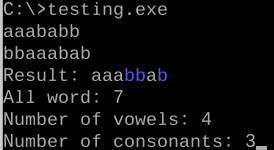
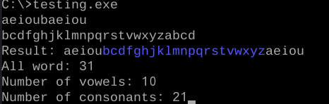

# Группы гласных и согласных на ассемблере

Учебная программа для DOS на 16-битном ассемблере (синтаксис TASM). Она считывает две строки строчных латинских букв и формирует результат из чередующихся групп:

1. Выводит очередную группу подряд идущих гласных (`a`, `e`, `i`, `o`, `u`) из первой строки.
2. Добавляет очередную группу подряд идущих согласных из второй строки.

Согласные первой строки и гласные второй строки пропускаются. Буквы второй строки выделяются синим цветом с помощью ANSI-последовательностей. В конце программа показывает количество выведенных гласных, согласных и всех букв.

## Результаты запуска

Первый пример:



Здесь из первой строки берутся группы `aaa` и `a`, из второй — `bb` и `b`: `aaa` + `bb` + `a` + `b`.

Второй пример — все гласные и согласные в двух строках:



После второй группы гласных программа достигает конца первой строки и не присоединяет следующую группу согласных `bcd` из второй строки. Буква `a` перед ними пропускается как гласная второй строки.

## Сборка и запуск

Понадобятся TASM, TLINK и среда DOS, например DOSBox-X. Из каталога с `testing.asm` выполните:

```dos
tasm testing.asm
tlink testing.obj
testing.exe
```

После запуска введите первую строку, нажмите Enter, затем введите вторую строку и снова нажмите Enter. Максимальная длина каждой строки — 99 букв.

## Ограничения исходной версии

- Обрабатываются только строчные латинские буквы `a`–`z`.
- Цвет требует поддержки ANSI-последовательностей в среде запуска.
- После вывода результата программа может не завершиться автоматически; в DOSBox-X её можно остановить, закрыв окно.

В репозитории находится только авторский исходный код. TASM, TLINK и DOSBox-X устанавливаются отдельно.
